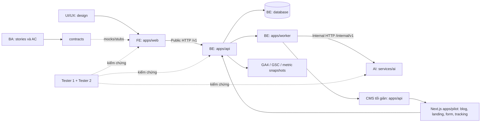

AI Growth OS là nền tảng dùng AI để hỗ trợ doanh nghiệp thu hút khách hàng qua nội dung, SEO và các kênh trực tuyến. Doanh nghiệp đưa ra mục tiêu, hệ thống sẽ tìm cơ hội, đề xuất kế hoạch, tạo nội dung và theo dõi hiệu quả để cải thiện những hoạt động tiếp theo.
Dự án giải quyết vấn đề: doanh nghiệp nhỏ thường thiếu nhân sự marketing, mất nhiều thời gian nghiên cứu và viết bài, đăng nội dung rời rạc, nhưng khó biết nội dung nào thực sự mang lại khách hàng.
Hệ thống hỗ trợ một quy trình liên tục:
1. Hiểu doanh nghiệp, sản phẩm và khách hàng mục tiêu.
2. Nghiên cứu xu hướng, nhu cầu tìm kiếm và cơ hội nội dung.
3. Lập kế hoạch, tạo bài viết và tối ưu SEO.
4. Cho người phụ trách duyệt rồi xuất bản.
5. Đo lượt truy cập, lượt đăng ký và kết quả chuyển đổi.
6. Dựa vào dữ liệu để đề xuất nội dung và hành động tiếp theo.
Pilot của nhóm triển khai cho TripC, hướng đến người nước ngoài nói tiếng Anh tại Đà Nẵng. Nhóm xây website và CMS tối giản bằng Next.js, đăng nội dung về nhà ở, coworking và dịch vụ địa phương; conversion chính ban đầu là gửi form đăng ký nhận thông tin hoặc tham gia danh sách chờ.
Giá trị cốt lõi: giúp doanh nghiệp tạo thêm lượng truy cập có khả năng trở thành khách hàng với cùng nguồn nhân lực, đồng thời biết hoạt động marketing nào mang lại hiệu quả.

# AI Growth OS — Cấu trúc dự án và kế hoạch pilot 4 tuần

Phiên bản tài liệu: 2.1 · Cập nhật: 05/10/2026 · Phạm vi: **16 module / 4 tuần / một website pilot**.

AI Growth OS giúp doanh nghiệp vận hành vòng **goal → knowledge → research → opportunity → strategy → content → approval → website publish → measurement → analyst → experiment → learning**. Mỗi module có chức năng tối thiểu, lưu dữ liệu thật và được nghiệm thu bằng acceptance criteria (AC).

README và [TODO](TODO.md) dùng kế hoạch 4 tuần ngày 05/10/2026 làm baseline thực thi. Mã **M01–M16 theo bản mới**, đã thay cách đánh số trước đây. [Bản đồ phạm vi](docs/ba/SCOPE.md) giải thích giới hạn từng module; [tài liệu nguồn](docs/sources/README.md) giữ PRD và các kế hoạch để truy vết.

**Trạng thái hiện tại (06/10/2026):** `apps/pilot`, `apps/web` và `apps/api` đã có bootstrap Next.js/TypeScript, manifest/lockfile riêng, env local, process health và bộ kiểm tra kết nối. Pilot/web là shell ban đầu; auth, CMS, database/queue nghiệp vụ và CI chưa triển khai. Dependencies local PostgreSQL/pgvector và SearXNG đã có smoke evidence trước đó. URL `https://aigrowthos-staging.pages.dev/` là trang thông báo riêng, GA4 đã nhận dữ liệu và GSC đã xác minh; chưa deploy ba app local lên URL này và chưa có live Google API connector. W1-PM-01/02 hoàn tất phần kế hoạch; các task sản phẩm/release gate vẫn cần triển khai và nghiệm thu.

### Chạy staging tối giản trên Windows

Node.js major 24 (`24.14.1`), ba app chạy ở port pilot `3001`, web `3000`, API `4000`:

```powershell
.\infra\staging\start.ps1
# Dừng các tiến trình do launcher tạo:
.\infra\staging\stop.ps1
```

Launcher build lần lượt, chạy `next start` trong nền và kiểm tra `/health`. Hướng dẫn cấu hình, kiểm thử và troubleshooting ở [infra/staging/README.md](infra/staging/README.md). Bootstrap này chưa hoàn thành chức năng sản phẩm.

## 1. Bắt đầu làm việc

1. Đọc bảng thư mục theo vị trí ở mục 3; chỉ chủ động sửa khu vực mình sở hữu.
2. Đọc module và giới hạn pilot ở mục 4; lấy task trong đúng tuần của [TODO](TODO.md).
3. BA chốt story/AC, BE cùng FE/AI/Tester 2 chốt [contract](contracts/README.md), UI/UX bàn giao spec.
4. Mỗi người triển khai/test độc lập bằng mock, stub hoặc fixtures theo cùng contract.
5. Tạo PR ngắn theo task, review và tích hợp mỗi ngày theo [CONTRIBUTING](CONTRIBUTING.md).
6. Demo staging thật cuối mỗi tuần. Mock đạt chỉ là `local_verified`; chỉ Done khi AC và kiểm thử tích hợp đạt.

Đội thực tế **8 người**: BA Dương; UI/UX Trường; FE Tiến/Huyền; BE Thiệu Quang/Mỹ; Tester Thanh; AI kiêm PM/PO Quang Quang. Thanh phụ trách hai lane QA, Quang Quang dùng chung thời gian AI/PM/PO. [TEAM](docs/coordination/TEAM.md) phân công chi tiết để hai FE/hai BE làm độc lập.

## 2. Cấu trúc thư mục và ghi chú owner

```text
AI-Growth-OS/
├── README.md                         # Đầu mối tích hợp: bản đồ và phân công
├── TODO.md                           # PM: checklist theo tuần 1–4
├── CONTRIBUTING.md                   # BE đầu mối: branch/review/merge
├── .gitignore / .gitattributes        # BE đầu mối: config chung
├── .github/                          # BE: PR template, ownership và CI
│   └── workflows/                    # BE triển khai; QA cung cấp checks
├── apps/
│   ├── pilot/                        # Tiến: Next.js website công khai TripC (blog/landing/form)
│   ├── web/                          # Tiến/Huyền: Next.js app quản trị và CMS UI
│   │   ├── src/app/                  # FE: routes, layouts, session shell
│   │   ├── src/features/             # FE: màn hình và logic theo module
│   │   ├── src/components/           # FE: component tái sử dụng
│   │   ├── src/lib/                  # FE: API client, env, helpers
│   │   ├── src/mocks/                # FE: mock API theo contract
│   │   └── tests/ + tasks/            # FE: unit/component tests, task riêng
│   ├── api/                          # BE: API và nghiệp vụ/dữ liệu
│   │   ├── src/app/                  # BE: HTTP routes
│   │   ├── src/modules/              # BE: domain logic theo module
│   │   ├── src/integrations/         # BE: OAuth, CMS/GA4/GSC config
│   │   ├── src/lib/                  # BE: DB, auth, tenant, queue, logs
│   │   └── tests/ + tasks/            # BE: API/unit tests, task riêng
│   └── worker/                       # BE: process xử lý nền
│       ├── src/jobs/                 # BE: ingestion, AI, publish, sync
│       ├── src/adapters/             # BE: adapter AI/CMS/analytics/queue
│       └── tests/ + tasks/            # BE: retry/recovery tests, task riêng
├── services/ai/                      # AI: pipeline và AI service
│   ├── src/agents/                   # AI: research/strategy/content/analyst
│   ├── src/rag/                      # AI: extract/chunk/retrieval
│   ├── src/providers/                # AI: fake/live LLM adapters
│   ├── src/guardrails/               # AI: facts/schema/brand/cost rules
│   ├── prompts/                      # AI: prompt có version
│   ├── evals/datasets/               # AI: bộ ca chuẩn, QA2 review
│   ├── evals/reports/                # AI: kết quả eval, QA2 kiểm chứng
│   └── tests/ + tasks/                # AI: unit/schema tests, task riêng
├── contracts/                        # BE đầu mối; FE/AI/QA2 review
│   ├── schemas/                      # OpenAPI/JSON Schema cần hoàn thiện
│   ├── examples/                     # Dữ liệu synthetic cùng contract
│   └── changes/                      # Mỗi thay đổi một CR riêng
├── database/                         # BE: migrations, seed, RLS/storage
│   └── migrations/ + seed/ + policies/
├── design/                           # UI/UX: toàn bộ thiết kế và handoff
│   └── tokens/ + assets/ + prototypes/ + specs/ + tasks/
├── qa/                               # Thanh: hai lane kiểm thử độc lập
│   ├── tester-1/                     # Tester 1: UI/nghiệp vụ/E2E/UAT
│   │   └── e2e/ + accessibility/ + uat/ + tasks/
│   ├── tester-2/                     # Tester 2: API/data/security/AI
│   │   └── api/ + contract/ + security/ + performance/ + ai-eval/ + tasks/
│   ├── fixtures/                     # Tester 2 đầu mối + BE review
│   └── evidence/                     # Tester lưu theo build/task riêng
├── docs/
│   ├── ba/                           # BA: story/AC/quy trình/dữ liệu
│   │   └── stories/ + acceptance/ + processes/ + data-dictionary/ + tasks/
│   ├── architecture/                # BE: quyết định kỹ thuật
│   ├── runbooks/                     # BE: deploy/rollback/restore
│   ├── coordination/                # PM: capacity/risks/weekly decisions
│   └── sources/                      # BA: tài liệu nguồn và baseline lịch sử
└── infra/                            # BE: cấu hình local/staging/production
```

Các thư mục đang rỗng có `.gitkeep`. FE/BE/AI tạo manifest và lockfile riêng trong đơn vị mình; không dùng một lockfile root để cả đội cùng sửa trong giai đoạn này. Tên feature/domain sẽ được tách thành file/thư mục nhỏ khi bootstrap, không dồn 16 module vào một file.

## 3. Thư mục nào dành cho vị trí nào?

Tất cả đường dẫn dưới đây tính từ root dự án.

| Vị trí | Thư mục/file được chủ động sửa | Đầu ra bàn giao | Người review |
| --- | --- | --- | --- |
| **BA: Dương** | `docs/ba/`; quản bản sao trong `docs/sources/` | 16 epic, stories, AC, KPI/role/state rules, UAT | PO, Tester, owner kỹ thuật |
| **UI/UX: Trường** | `design/` | Prototype, tokens/assets, specs đủ states, design QA | FE, BA, Tester 1 |
| **FE: Tiến/Huyền** | `apps/web/`; Tiến sở hữu `apps/pilot/` | Screens/components, API client/mocks, editor, dashboard, pilot tracking/widget | UI/UX, BE, Tester 1 |
| **BE: Thiệu Quang/Mỹ** | `apps/api/`, `apps/worker/`, `database/`, `infra/`, `docs/architecture/`, `docs/runbooks/` | Auth/RBAC, APIs/DB/jobs, CMS/analytics/tracking/experiment data, vận hành | FE/AI cho interface, Tester 2 |
| **AI: Quang Quang** | `services/ai/` | Context/RAG, agents, prompts, output schemas/evidence, eval | BE, BA, Tester 2 |
| **Tester lane 1: Thanh** | `qa/tester-1/` | UI/nghiệp vụ/E2E/accessibility/UAT cases và evidence | BA, FE, Tester 2 |
| **Tester lane 2: Thanh** | `qa/tester-2/`; đầu mối `qa/fixtures/` | API/contract/tenant/jobs/integration/AI/data tests | BE, AI, Tester 1 |
| **PM/PO: Quang Quang** | `docs/coordination/`, `TODO.md` | Capacity, ngày bàn giao, blockers, weekly demo, release decision với PO | PO và owner task |
| **BE đầu mối tích hợp** | `contracts/`, `.github/`, root config, `README.md`, `CONTRIBUTING.md` | Contract baseline, CI/ownership, xử lý merge và config chung | Mọi consumer bị ảnh hưởng |

`qa/evidence/<build>/<task>/` do Tester tạo bằng chứng cập nhật; dùng tên riêng để không sửa cùng file. Developer giữ unit tests bên cạnh source, Tester giữ suite độc lập dưới `qa/`.

**Khu vực dùng chung phải có đầu mối merge:** contract do BE merge sau review của FE/AI/QA2; token/spec do UI/UX merge sau FE review; migration chỉ BE merge. Role trong đội phát triển khác role sản phẩm: pilot chỉ **Owner, Editor, Viewer** theo kế hoạch.

## 4. Bản đồ 16 module và khu vực triển khai

Các tên dưới `src/features/`, `src/modules/`, `src/agents/` là quy ước đề xuất để owner tạo khi triển khai. Chúng chưa phải feature đã có code.

| Mã | Module | Tuần | FE tại `apps/web/src/features/` | BE tại `apps/api/src/modules/` / worker | AI tại `services/ai/` |
| --- | --- | --- | --- | --- | --- |
| M01 | Workspace | 1 | `workspace`, `onboarding` | `identity`, `workspaces`, `business` | Business context/Growth Map |
| M02 | Business Knowledge Base | 1 | `knowledge` | `knowledge` + ingestion job | `rag`, approved-source retrieval |
| M03 | Growth Goal Manager | 1 | `goals` | `goals` | Objective/KPI suggestions |
| M04 | Market Intelligence Engine | 2 | `research` | `research`, jobs | Research có nguồn |
| M05 | Opportunity Engine | 2 | `opportunities` | `opportunities` | Score/rationale theo rubric |
| M06 | Growth Strategy Engine | 2 | `strategy`, `tasks` | `strategies`, `tasks` | Plan 30 ngày cần duyệt |
| M07 | Content Intelligence Engine | 2 | `briefs` | `briefs` | Brief có facts/CTA/source |
| M08 | AI Content Factory | 2 | `content`, `variants` | `contents`, versions, generation job | Article/FAQ/meta/social draft |
| M09 | SEO Intelligence Engine | 2–3 | `seo` | `seo`, small audit jobs | Cluster/link/local draft/refresh cơ bản |
| M10 | Distribution Engine | 3 | `approval`, `calendar` | `approval`, `publishing` + CMS worker | Format/channel check |
| M11 | Community Growth Engine | 3 | `community` | `community` | Intent/response có nguồn |
| M12 | Traffic Engine | 3; tracking chuẩn bị tuần 1 | `traffic`, pilot instrumentation | `tracking`, UTM/events | Channel recommendation |
| M13 | Analytics Engine | 1–3 | `integrations`, `analytics` | `integrations`, `metrics` + GA4/GSC sync | Metric normalization |
| M14 | AI Growth Analyst | 4 | `reports`, action review | `reports`, snapshots | Growth Brief có evidence |
| M15 | Experiment Engine | 4 | `experiments`, pilot widget | `experiments`, assignment/events/results | Hypothesis, giới hạn kết quả |
| M16 | Learning Engine | 4 | `learning` | `learning`, strategy version update | Rules/insight cần duyệt |

BA viết story/AC, UI/UX làm spec và Thanh kiểm thử cả hai lane xuyên suốt tất cả 16 module. **Approval là phần dùng chung trong M10**; M08/M11 sử dụng lại, không tự tạo ba quy trình duyệt khác nhau.

## 5. Ghi chú kế hoạch theo từng tuần

Tuần tính từ kickoff, **5 ngày làm việc/tuần**, chưa gán ngày lịch thực tế. [TODO](TODO.md) có checklist chi tiết của từng vị trí.

**[Bảng việc riêng cho từng người, đủ 4 tuần](docs/coordination/weekly-todos/README.md)** giải thích từng phần task, thứ tự làm, mốc ngày, đầu ra, phụ thuộc, reviewer và tiêu chí hoàn thành. TODO có bảng phân công theo tên ngay trong từng tuần; trạng thái task gốc giữ tại TODO.

Để bắt tay triển khai, đọc **[checklist hành động W1–W4](docs/coordination/execution/README.md)**: mỗi tuần/nhân sự có task con cụ thể tới API, dữ liệu, màn hình, pipeline, phiên bản và ca lỗi phải kiểm. [Data/flows](docs/coordination/execution/DATA-AND-FLOWS.md) có fields cho 16 module, route mapping, quyền và numeric/idempotency examples; thiết kế mới được đánh dấu đề xuất để owner freeze qua contract review.

| Người | Mở kế hoạch của mình | Khu vực chính |
| --- | --- | --- |
| Quang Quang | [AI + PM + PO](docs/coordination/weekly-todos/QUANG-QUANG.md) | `services/ai/`, `docs/coordination/`, `TODO.md` |
| Dương | [BA](docs/coordination/weekly-todos/DUONG.md) | `docs/ba/`, `docs/sources/` |
| Thiệu Quang | [BE core/contract](docs/coordination/weekly-todos/THIEU-QUANG.md) | API core/domains, `contracts/`, migrations/policies, `infra/`, `.github/` |
| Mỹ | [BE jobs/integrations](docs/coordination/weekly-todos/MY.md) | API tích hợp/metrics/jobs, `apps/worker/`, seed, runbooks |
| Tiến | [FE shell/public website](docs/coordination/weekly-todos/TIEN.md) | `apps/pilot/`, web common/routes/config và features theo TEAM |
| Huyền | [FE content/review](docs/coordination/weekly-todos/HUYEN.md) | Web knowledge/content/review/report/learning, mocks/tests |
| Trường | [UI/UX](docs/coordination/weekly-todos/TRUONG.md) | `design/` |
| Thanh | [QA hai lane](docs/coordination/weekly-todos/THANH.md) | `qa/tester-1/`, `qa/tester-2/`, fixtures/evidence |

Task chung FE/BE chỉ Done khi đủ các phần đã chia theo người. Quang Quang và Thanh dùng một kế hoạch/WIP cho vai trò kiêm nhiệm. Thư mục feature đề xuất chưa phải code đã có; ranh giới source chi tiết theo [TEAM](docs/coordination/TEAM.md).

### Tuần 1 — Nền tảng và M01–M03; tracking M13 từ đầu

- **Ngày 1–2:** PM/PO chốt độ sâu pilot và capacity; BA soạn AC sơ bộ đủ 16 module; BE/FE/AI thống nhất contract, jobs, metric/assignment schemas và quyền tích hợp.
- **Ngày 3–4:** FE/BE/AI tích hợp workspace/onboarding → knowledge/source review → goal → RAG có nguồn. FE/BE đặt tracking tối thiểu trên website pilot; kiểm tra CMS/GA4/GSC từ tuần này.
- **Ngày 5:** QA chạy tenant/RBAC/source/facts tests và demo staging. BA/UIUX chuẩn bị research/board/brief/editor cho tuần 2.
- **Gate W1:** dữ liệu M01–M03 lưu và mở lại được; Viewer không sửa; tenant A không đọc B; source xóa không còn truy hồi. Contract của cả 16 module có baseline để tiếp tục.

### Tuần 2 — M04–M08 và SEO cơ bản M09

- **Ngày 6–7:** research có evidence → opportunity score/board.
- **Ngày 8:** strategy có owner/effort/deadline/KPI và duyệt → brief giữ nguồn/CTA.
- **Ngày 9:** AI draft/editor/version/variant; title/meta/headings và rule SEO cơ bản.
- **Ngày 10:** tích hợp/demo, PM review capacity cho publish/analytics/experiment/learning. BA/UIUX bàn giao tuần 3.
- **Gate W2:** một opportunity tạo được strategy/brief đã duyệt và draft có nguồn, CTA, version; score kiểm tra được theo rubric; dữ liệu demand không có nguồn được để thiếu.

### Tuần 3 — M09–M13: SEO, approval/CMS, community, UTM, analytics

- **Ngày 11:** SEO audit/cluster/link/local draft/refresh giới hạn + approval/reject/resubmit.
- **Ngày 12:** đăng CMS thật, calendar, idempotency và recovery.
- **Ngày 13:** Community Radar/response/approve/handoff thủ công; UTM nối campaign/content.
- **Ngày 14:** GA4/GSC/dashboard, sync/timezone/zero/missing; snapshot đầu vào analyst và experiment.
- **Ngày 15:** regression/demo và khóa chức năng mới M01–M13; UIUX/BA bàn giao report/experiment/learning cho tuần 4.
- **Gate W3:** bản duyệt đăng CMS thật có URL/tracking; retry không trùng; dashboard đối chiếu nguồn; kênh ngoài CMS được ghi rõ draft/export hoặc handoff thủ công.

### Tuần 4 — M14–M16; UAT, release và bàn giao

- **Ngày 16:** Growth Brief từ snapshots, hai kỳ, số/% đúng, action cần duyệt.
- **Ngày 17:** experiment hai biến thể title/CTA trên một trang pilot; stable assignment, exposure/outcome và dedup events.
- **Ngày 18:** learning insight có evidence → duyệt → strategy version mới; freeze toàn bộ feature.
- **Ngày 19:** E2E/UAT 16 module, retest blockers, backup/restore/rollback evidence.
- **Ngày 20:** PM/PO go/no-go, rollout pilot, release smoke và owner vận hành.
- **Gate W4:** chạy đủ vòng goal → learning, từng module có AC/evidence, không còn blocker/critical; thiếu mẫu experiment được ghi “chưa đủ bằng chứng”, không tuyên bố winner hoặc hiệu quả growth.

## 6. Cách làm độc lập trước merge

| Vị trí | Đầu vào | Cách làm độc lập | Bằng chứng trước tích hợp |
| --- | --- | --- | --- |
| BA | PRD + kế hoạch 4 tuần | Markdown story/AC; một feature một file | AC, dependency, role/KPI/state definitions |
| UI/UX | Story và field/state contract | Prototype/spec/tokens với data synthetic | Handoff đủ loading/empty/error/permission |
| FE | Contract + design | Mock API trong vùng FE, unit/component tests | UI demo mock, consumer checks |
| BE | AC + schemas | DB local riêng, AI stub, fake CMS/GA4/GSC | API/RLS/jobs/migration tests |
| AI | Approved context + operation schemas | Fixtures/LLM fake; eval live tách biệt | Schema/facts/retrieval eval và cost traces |
| Tester 1 | AC + prototype/mock UI | Viết scenarios trước, chạy mock rồi staging | UI cases/E2E có test IDs và evidence |
| Tester 2 | Schemas + fixtures hai tenant | Validate contracts, test API/stub, AI eval | Tenant/API/jobs/numeric/security evidence |

BA/UIUX chuẩn bị theo **lô trước 1–2 ngày**; QA test từng lát chức năng mỗi ngày. FE/BE chỉ giữ một feature chính và một lane sửa lỗi. AI dùng pipeline/context/schema/logging chung, không phát triển hệ đa agent độc lập trong pilot.

## 7. Ranh giới kỹ thuật và quy trình merge



Người dùng đã chốt FE/BE **TypeScript**, AI **Python**; website pilot và CMS tối giản dùng **Next.js/TypeScript**. `apps/pilot/` là blog/landing/form công khai, `apps/web/` là quản trị/CMS UI; `apps/api/` giữ nghiệp vụ CMS, xuất bản và dữ liệu form. BE chốt cách tổ chức Next.js API và worker TypeScript ở W1-BE-01; AI dùng FastAPI theo quyết định cơ sở. Baseline W1-PM-02 chọn PostgreSQL + pgvector, SearXNG tự host và pg-boss worker; người dùng chọn Ollama local và máy chủ sẵn có. Versions và access/probes còn do BE kiểm chứng ngày 1–2. [DEC-001](docs/ba/processes/DEC-001-LANGUAGES.md) ghi ngôn ngữ; [PILOT](docs/coordination/PILOT.md) ghi quyết định website. Worker làm job dài ngoài request web; AI không publish, không giữ CMS/OAuth credentials hoặc tự cập nhật strategy.

- Cổng dự kiến: quản trị web `3000`, pilot `3001`, API `4000`, AI nội bộ `5000`. `.env.example` là tên biến đề xuất; từng owner triển khai và kiểm chứng lệnh chạy thật.
- FE không query DB trực tiếp; AI nhận tenant-scoped retrieval/snapshots. API kiểm tra membership/RBAC, DB/storage/vector có tenant policies.
- Contract là request/response/schema/state/error agreement. BE đầu mối merge sau consumer review; contract PR trước, implementation PR theo sau.
- Mỗi task một branch ngắn như `fe/W2-FE-03-content-editor`; không dồn cả bốn tuần vào branch theo vị trí.
- Chỉ sửa source của vị trí khác khi owner đồng ý và review. File chung, migration, tokens và contract có owner rõ, không cùng sửa tùy ý.
- Thay đổi interface cần version/consumer checks; migration tương thích trước rồi chuyển consumer. Tính năng chưa đủ bật qua feature flag sau gate.
- CI, owner enforcement và branch protection là việc tuần 1, hiện chưa tự động bảo vệ merge.

Cấu trúc này giảm conflict file; để giảm lỗi hành vi khi merge vẫn phải có contract checks và E2E staging với service thật.

## 8. Capacity, chất lượng và Definition of Done

Theo kế hoạch mới, mỗi người có **20 ngày danh nghĩa**, giữ **5 ngày** cho review/tích hợp/sửa lỗi/bàn giao, tối đa **15 ngày tính năng**. Roster hiện có 8 người; W1-PM-02 đã chuyển sang effort tương đối S/M/L và mốc bàn giao theo chỉ đạo mới, không yêu cầu bảng giờ chi tiết; trong đó AI/PM/PO dùng chung capacity Quang Quang và hai lane QA dùng chung capacity Thanh. Không dùng con số 105 ngày và PM riêng của kế hoạch gốc để cam kết cho roster mới. Không lấy capacity BA/QA bù lập trình FE/BE/AI.

Ngày 2 các owner rà effort theo task và dependency với baseline local/cost/token/timeout/tải đã lập ở W1-PM-02; ngày 10 review lại. Nếu vượt capacity, PO/PM giảm độ sâu trong 16 module, bổ sung người phù hợp hoặc đổi mốc. Bốn tuần là mục tiêu có điều kiện của pilot.

Một task chỉ Done khi code review/checks đạt, FE/API tích hợp staging, AC đạt, QA có evidence và docs cập nhật. Các checks xuyên suốt:

- Tenant/RBAC đúng; source bị xóa không vào RAG; facts thiếu được báo thiếu.
- Duyệt gắn content version/hash; sửa sau duyệt phải duyệt lại; publish retry không trùng.
- UTM/event nối đúng campaign/content; assignment ổn định và events không đếm trùng.
- Metric `0` khác missing/delayed; report số/% khớp snapshot, baseline 0 không chia sai.
- Insight truy ngược evidence, thay strategy chỉ sau duyệt; thiếu dữ liệu không khẳng định winner/nhân quả.
- Secrets không vào log; migration/backup/restore/rollback đã kiểm tra trước release.

AI + Tester 2 chốt **ít nhất 30 ca tuần 1**, bổ sung ca M15–M16 khi contract chốt. Gate đề xuất theo kế hoạch: 100% critical cases đạt, ≥90% facts/retrieval chuẩn đạt, số report mẫu khớp input; BA/PO xác nhận rubric. Mock/synthetic data không thay cho kết nối CMS/GA4/GSC thật. Traffic/revenue tăng không phải cam kết nghiệm thu trong bốn tuần.

## 9. Giới hạn pilot và tài liệu tham chiếu

Pilot TripC có website/CMS Next.js tối giản, nội dung tiếng Anh cho expat tại Đà Nẵng; ưu tiên nhà ở/khu vực sinh sống. Conversion chính là form đăng ký nhận thông tin được server lưu thành công; human approval bắt buộc trước publish. Pilot hỗ trợ một timezone, một trang experiment; text/PDF có lớp văn bản/URL được phép; SEO trên tập URL nhỏ; community nhập thủ công hoặc nguồn được phép; social là draft/export/handoff. Billing chỉ quota/cost logging, chưa thanh toán production.

Sau pilot mới mở rộng nhiều CMS/social publishing, OCR/media, crawler/rank data lớn, community discovery tự động, multi-touch attribution, thống kê experiment nâng cao và learning tự động. Các phần mở rộng không nằm trong checklist bốn tuần.

- [TODO theo tuần 1–4](TODO.md)
- [Scope và AC tối thiểu của 16 module](docs/ba/SCOPE.md)
- [Hợp đồng tích hợp](contracts/README.md)
- [Quy trình review/merge](CONTRIBUTING.md)
- [Owner từng khu vực](.github/OWNERSHIP.md)
- [Nguồn kế hoạch mới và lịch sử](docs/sources/README.md)
- [Backlog 17 epic, owner/reviewer/AC/dependencies](docs/coordination/backlog/README.md)
- [Biên bản hoàn thành W1-PM-01](docs/coordination/W1-PM-01.md)
- [Đội thực tế và ranh giới source](docs/coordination/TEAM.md)
- [Pilot TripC](docs/coordination/PILOT.md) và [dataset manifest](docs/coordination/PILOT_DATASET.json)
- [Nguồn crawl đề xuất đã khảo sát](docs/coordination/SOURCES.md)
- [Skills hỗ trợ](docs/coordination/SKILLS.md)


## Kế hoạch PM tuần 1 — cập nhật theo phương án local

[W1-PM-02](docs/coordination/W1-PM-02.md) quản theo task/mốc, không yêu cầu bảng giờ chi tiết. AI chạy Ollama local, hosting trên server của nhóm; PostgreSQL + pgvector và SearXNG self-host là baseline. Paid AI/search/cloud hosting/database mặc định tắt, chi phí điện/phần cứng/domain không được coi là bằng 0. [PILOT_LIMITS](docs/coordination/PILOT_LIMITS.md) ghi token/timeout/concurrency/load.

[W1-PM-03](docs/coordination/W1-PM-03.md) có access matrix, [risks/blockers](docs/coordination/RISKS.md), [deployment plan](infra/local/README.md) và [demo ngày 5](docs/coordination/DEMO-W1.md). Máy Windows hiện tại được người dùng chọn làm host; Ollama/embeddings/PostgreSQL/pgvector/SearXNG đã probe thành công. Public website/CMS và GA4/GSC chưa triển khai/verify, demo vẫn planned. Toàn bộ W1-PM-03 giữ mở đến khi có evidence thật.
