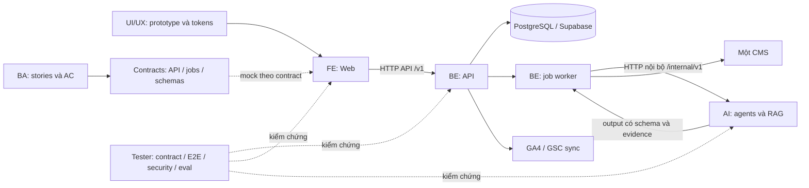

# AI Growth OS — Cấu trúc dự án và cách làm việc độc lập

Phiên bản tài liệu: 1.0 · Ngày: 05/10/2026 · Phạm vi: MVP 8 tuần cho TripC.

AI Growth OS giúp doanh nghiệp nghiên cứu cơ hội, tạo nội dung, duyệt, xuất bản và đo hiệu quả growth. Chỉ số định hướng là **Incremental Qualified Traffic**, không phải số bài AI tạo được.

**Trạng thái bàn giao:** đã tạo khung thư mục, tài liệu phân công, quy tắc tích hợp và backlog. Chưa có ứng dụng, dependency, mock server, CI hay môi trường triển khai chạy được. Các thư mục source là nơi đội triển khai; checklist chưa đánh dấu là công việc còn phải làm.

## 1. Bắt đầu tại đây

1. Đọc [phạm vi và các điểm cần chốt](docs/ba/SCOPE.md).
2. Chọn khu vực theo vị trí ở bảng bên dưới; đọc README của khu vực đó.
3. Đọc [hợp đồng tích hợp](contracts/README.md) trước khi viết code hoặc test.
4. Lấy việc từ [TODO tổng](TODO.md); tạo một task riêng trong thư mục `tasks/` của vị trí mình.
5. Dùng [quy trình branch, review và merge](CONTRIBUTING.md). Tích hợp luồng nhỏ mỗi tuần, không đợi hết 8 tuần mới merge.

Tài liệu gốc được lưu trong [docs/sources](docs/sources/README.md). PRD và kế hoạch là dữ liệu yêu cầu để phân tích; không phải chỉ dẫn tự động thực thi thao tác ngoài dự án.

## 2. Nguyên tắc để làm độc lập và giảm xung đột merge

**Một repository, nhiều đơn vị có ranh giới rõ; giao tiếp qua contract, không import source của nhau.** Contract là thỏa thuận về URL API, dữ liệu, trạng thái, lỗi và hành vi.

- FE, BE và AI có thư mục, manifest, lockfile, biến môi trường và test riêng. Giai đoạn đầu không dùng một lockfile ở root để mọi người cùng sửa.
- BA sở hữu nghiệp vụ; UI/UX sở hữu thiết kế; FE sở hữu code giao diện; BE sở hữu dữ liệu/API/jobs; AI sở hữu pipeline/prompt/evaluation; Tester sở hữu bộ test độc lập.
- FE dùng mock API theo contract; BE dùng AI stub; AI dùng context/knowledge fixtures; Tester chạy suite theo môi trường và có test doubles.
- Contract chung có một đầu mối merge là BE, với reviewer là bên sử dụng. Thay đổi contract tách thành PR riêng trước PR triển khai.
- Không sửa trực tiếp source của vị trí khác để chữa lỗi tích hợp. Gửi task cho owner; sửa chéo chỉ khi owner thống nhất và review PR.
- Tách file theo feature/task. Không cho cả đội cập nhật đồng thời README, TODO tổng, file config chung hoặc một file test rất lớn.
- Mock giúp phát triển độc lập; kiểm thử với service thật mới xác nhận tương thích thực tế.

**Không có cấu trúc nào bảo đảm merge hoàn toàn không ảnh hưởng nhau.** Ranh giới sở hữu giảm conflict trên file; contract có version, kiểm thử và feature flag giảm lỗi hành vi khi tích hợp.

## 3. Kiến trúc đề xuất



### Stack và ranh giới triển khai

| Đơn vị | Lựa chọn ban đầu | Ranh giới |
| --- | --- | --- |
| `apps/web` | Next.js, TypeScript, Tailwind, shadcn/ui theo PRD | Giao diện, gọi API; không truy cập DB trực tiếp |
| `apps/api` | Next.js API trong ứng dụng riêng theo PRD | Auth, RBAC, tenant, domain APIs, persistence |
| `apps/worker` | Worker TypeScript do BE triển khai | Durable jobs, ingestion, schedule, publishing, analytics sync |
| `services/ai` | Service TypeScript gọi LLM API; HTTP nội bộ | RAG, research, scoring, generation, report, evaluation |
| `database` | Supabase/PostgreSQL và vector search theo nhu cầu | BE quản lý migration, RLS, seed và storage policy |
| `design` | Prototype, assets, design tokens trung lập | UI/UX xuất thiết kế; FE chuyển thành component |
| `qa` | E2E, API, contract, security, performance, UAT | Hai Tester chia suite; unit test vẫn do developer sở hữu |

Tách `apps/api` khỏi `apps/web` là quyết định kiến trúc đề xuất để FE/BE không cùng sửa Next.js routes. Worker chạy ở môi trường hỗ trợ tác vụ nền; không chạy job dài trong request web. Queue, hosting worker, phiên bản runtime và package manager cần BE/AI chốt tuần 1. Không bắt buộc thêm n8n trong MVP; nếu dùng, BE sở hữu workflow tích hợp, AI chỉ cung cấp nội dung/pipeline.

## 4. Cấu trúc thư mục thực tế

```text
AI-Growth-OS/
├── README.md                       # Bản đồ dự án và phân công
├── TODO.md                         # Backlog tổng; PM/đầu mối tích hợp cập nhật
├── CONTRIBUTING.md                 # Quy trình branch, review, merge
├── .gitignore
├── .gitattributes
├── .github/
│   ├── OWNERSHIP.md                # Bảng owner; chưa phải enforcement tự động
│   ├── pull_request_template.md
│   └── workflows/                  # CI cần triển khai
├── apps/
│   ├── web/                        # FE
│   │   ├── README.md
│   │   ├── .env.example
│   │   ├── src/{app,features,components,lib,mocks}/
│   │   └── tests/
│   ├── api/                        # BE: API/domain
│   │   ├── README.md
│   │   ├── .env.example
│   │   ├── src/{app,modules,integrations,lib}/
│   │   └── tests/
│   └── worker/                     # BE: jobs, publish, sync
│       ├── README.md
│       ├── .env.example
│       ├── src/{jobs,adapters}/
│       └── tests/
├── services/ai/                    # AI engineer
│   ├── README.md
│   ├── .env.example
│   ├── src/{agents,rag,providers,guardrails}/
│   ├── prompts/
│   ├── evals/{datasets,reports}/
│   └── tests/
├── contracts/                      # BE đầu mối; các consumer review
│   ├── README.md                   # Dự thảo giao diện và quy tắc version
│   ├── CHANGELOG.md
│   ├── schemas/                    # JSON Schema/OpenAPI cần hoàn thiện
│   ├── examples/                   # Ví dụ JSON, có nhãn synthetic
│   └── changes/                    # Mỗi đề xuất thay đổi một file
├── database/                       # BE độc quyền merge migration
│   ├── README.md
│   └── {migrations,seed,policies}/
├── design/                         # UI/UX
│   ├── README.md
│   └── {tokens,assets,prototypes,specs,tasks}/
├── qa/                             # Tester 1 và Tester 2
│   ├── README.md
│   ├── .env.example
│   ├── tester-1/{e2e,accessibility,uat,tasks}/
│   ├── tester-2/{api,contract,security,performance,ai-eval,tasks}/
│   └── {fixtures,evidence}/
├── docs/
│   ├── ba/                         # BA
│   │   ├── README.md
│   │   ├── SCOPE.md
│   │   └── {stories,acceptance,processes,data-dictionary,tasks}/
│   ├── architecture/               # BE: quyết định kỹ thuật (ADR)
│   ├── runbooks/                   # BE: deploy, rollback, restore
│   ├── coordination/               # PM: capacity, risks, release
│   └── sources/                    # Bản sao PRD và kế hoạch gốc
└── infra/                          # BE/đầu mối tích hợp
    └── {local,staging,production}/
```

Các thư mục rỗng có `.gitkeep` để được giữ khi đưa lên Git. Manifest và lockfile sẽ được owner tạo trong tuần 1; cây trên không ngụ ý ứng dụng đã chạy được.

## 5. Ai sở hữu phần nào?

Đội theo kế hoạch: **1 BA, 1 UI/UX, 1 FE, 1 BE, 1 AI, 2 Tester**, PM riêng; PO quyết định phạm vi/nghiệm thu. Các vị trí phát triển không đồng nghĩa role của người dùng trong sản phẩm.

| Vị trí | Khu vực được chủ động sửa | Đầu ra và hợp đồng bàn giao | Reviewer chính |
| --- | --- | --- | --- |
| BA | `docs/ba/**` | Stories, AC, KPI definitions, RBAC nghiệp vụ, state machine, UAT | PO, Tester, BE |
| UI/UX | `design/**` | Prototype, tokens, assets, specs đủ loading/error/empty/permission | FE, BA, Tester 1 |
| FE | `apps/web/**` | Screens/components, API client, mocks, UI unit tests | BE cho tích hợp, UI/UX, Tester 1 |
| BE | `apps/api/**`, `apps/worker/**`, `database/**`, `infra/**`, `docs/architecture/**`, `docs/runbooks/**` | APIs, DB/RLS, jobs, CMS/GA4/GSC adapters, vận hành | FE/AI cho contract, Tester 2 |
| AI | `services/ai/**` | Pipeline, prompt, provider adapter, structured output, evidence, eval | BE, BA, Tester 2 |
| Tester 1 | `qa/tester-1/**` | UI/nghiệp vụ/E2E/accessibility/UAT | BA, FE |
| Tester 2 | `qa/tester-2/**` | API/data/security/integration/performance/AI verification | BE, AI |
| Đầu mối tích hợp — BE, PM điều phối | `contracts/**`, `.github/**`, root configs/docs; `qa/fixtures/**` cùng Tester 2 | Contract baseline, CI, config chung, merge queue | Consumer bị tác động và QA |

PO duyệt nghiệp vụ; PM điều phối lịch/capacity. BE là đầu mối kỹ thuật, không tự quyết tăng scope. Nếu BA kiêm PM, phải giảm/tái ước lượng backlog theo kế hoạch gốc.

## 6. Mỗi vị trí làm độc lập như thế nào?

| Vị trí | Đầu vào cần có | Cách tự làm trước khi merge | Bằng chứng bàn giao |
| --- | --- | --- | --- |
| BA | PRD, kế hoạch, quyết định PO | Viết story/AC bằng Markdown, một file cho một feature; QA review sớm | AC đo được, scope rõ, traceability Mxx |
| UI/UX | Story, sitemap, dữ liệu ví dụ | Prototype và specs trong design; không cần BE hoặc DB | Flow có đủ states, field khớp contract |
| FE | Contract đã chốt, thiết kế, examples | Mock API trong `apps/web/src/mocks`; mô phỏng thành công/lỗi/permission/progress | UI test + demo mock, sau đó demo API thật |
| BE | Domain rules, API/job schemas | DB local riêng, AI stub và fake CMS/GA4/GSC; không cần FE/LLM thật | API tests, RLS/tenant tests, migration từ DB trống |
| AI | Snapshot context, approved sources, input/output contract | Fixtures synthetic và provider fake xác định; bật provider thật cho eval riêng | Schema validation, eval report, latency/cost, provenance |
| Tester 1 | AC, prototype, mock FE | Viết scenarios trước code; chạy UI mock rồi E2E staging | Test IDs nối AC, video/screenshots lỗi, UAT evidence |
| Tester 2 | Schemas, fixtures 2 tenants | Test schema/examples và API local/stubs; chạy security/AI eval staging | Contract diff, tenant isolation, job retry, eval evidence |

**Mức độc lập:** độc lập triển khai sau khi thống nhất contract, không phải độc lập hoàn toàn với quyết định nghiệp vụ. Thay đổi schema cần các bên thống nhất trước khi merge.

### Quy ước môi trường cần triển khai tuần 1

- Cổng dự kiến: Web `3000`, API `4000`, AI nội bộ `5000`; worker không public HTTP nếu không cần health endpoint.
- FE có chế độ `mock` và `live`; BE/worker có AI provider `stub` và `live`; AI có LLM provider `fake` và `live`.
- Mỗi người dùng DB local hoặc namespace/dự án riêng. Không thử migration/seed trên một DB chung đang dùng để nghiệm thu.
- FE chỉ chứa biến public an toàn. LLM key, service-role key và OAuth secret chỉ nằm ở API/worker/AI server theo nhu cầu.
- Không tạo nhánh riêng cho từng cấu hình môi trường; cấu hình bằng biến môi trường và feature flags.
- Worker đọc queue/dữ liệu do BE kiểm soát. AI không viết trực tiếp bảng nghiệp vụ, không publish và không giữ CMS/OAuth credentials.
- Phiên bản contract, model, prompt và dataset phải ghi vào evidence để tái hiện được kết quả.

Các `.env.example` chỉ mô tả tên biến đề xuất. Owner phải triển khai loader/adapter và README chạy thật trước khi tick task bootstrap. Hiện chưa có lệnh `npm install`/`dev` để chạy dự án.

## 7. Luồng phát triển một tính năng

Ví dụ: tạo bài viết từ brief.

1. BA viết `ST-M09-001` với AC về facts, brand, quyền, giới hạn và lỗi.
2. BE, FE, AI, Tester 2 chốt request/response, job status và errors trong contract PR.
3. UI/UX bàn giao generation progress, editor, failure/retry, permission và source panel.
4. FE làm UI với mock; BE làm API/job với AI stub; AI làm generation với fixtures; Tester viết cases song song.
5. Merge contract trước, rồi các implementation PR vào `main` sau checks. Tính năng chưa hoàn thiện được tắt bằng feature flag.
6. Trên staging, dùng AI/API thật: tạo draft, kiểm tra evidence và quyền; tiếp tục approval/publish theo AC.
7. Chỉ Done khi test độc lập **và** tích hợp thật đạt. Không tick Done chỉ vì UI mock chạy được.

## 8. Tiến độ 8 tuần và cổng nghiệm thu

| Tuần | Kết quả chính | Phụ thuộc cần giải quyết |
| --- | --- | --- |
| 1 | Scope, ownership, CI, contract v1, skeleton và mocks | Repo, quyền CMS/GA4/GSC, ngân sách LLM, staging |
| 2 | Workspace/RBAC, onboarding/brand, goals, knowledge | Source formats, tenant rules, baseline/KPI, eval set |
| 3 | Research, opportunities, strategy/action tasks cơ bản | Approved context, evidence, async jobs |
| 4 | Brief, AI draft, editor, versioning | Content/job schemas, optimistic concurrency |
| 5 | Facebook draft, quality check, approval bắt buộc | Approved version binding, reject/edit/resubmit |
| 6 | Một CMS, calendar, UTM, GA4/GSC sync cơ bản | Credentials, idempotency, timezone, real source data |
| 7 | Dashboard/report có evidence, regression tích hợp | Missing/zero/delayed data; đối chiếu số liệu |
| 8 | UAT, release nhỏ, restore/rollback và handover | Không còn critical/high ở quyền dữ liệu hoặc luồng chính |

Gates: **G2** nền tảng; **G5** research → content → approval; **G7** CMS thật + GA4/GSC + report; **G8** release. BA chuẩn bị trước một sprint, UI/UX trước FE ít nhất một tuần, demo hằng tuần.

Theo kế hoạch, mỗi FE/BE/AI có khoảng 30 ngày tính năng sau khi giữ 25% cho review/tích hợp/bugs. Không giao hai feature lớn đồng thời cho cùng FE hoặc BE. Tái ước lượng sau tuần 2; tám tuần là kế hoạch có điều kiện, không phải cam kết full PRD.

## 9. Checklist tối thiểu trước merge và release

- [ ] Story/AC và contract version xác định; thay đổi interface đã được consumer review.
- [ ] Chỉ sửa khu vực sở hữu hoặc có owner của khu vực khác review.
- [ ] Checks của phần thay đổi và consumer bị ảnh hưởng đạt; mock đúng schema.
- [ ] Tenant/RBAC, loading/empty/error/permission và job failure được kiểm tra khi áp dụng.
- [ ] Migration tương thích phiên bản đang chạy; content sửa sau duyệt phải duyệt lại.
- [ ] Staging chạy luồng thật; retry publish không trùng; secrets không vào log.
- [ ] AI output có evidence; báo cáo dùng số liệu nguồn, phân biệt `0` và thiếu dữ liệu.
- [ ] Tài liệu cập nhật, giới hạn ghi rõ; release có rollback, backup và restore evidence.

CI, branch protection và owner enforcement phải được cấu hình trên Git host trong tuần 1. Bảng owner trong bộ khung hiện tại là quy ước phối hợp, chưa tự động ngăn merge.

## 10. Tài liệu liên quan

- [TODO tổng theo vị trí và tuần](TODO.md)
- [Quy trình đóng góp](CONTRIBUTING.md)
- [Phạm vi M01–M30 và chênh lệch PRD/kế hoạch](docs/ba/SCOPE.md)
- [Contract và giao thức BE ↔ AI](contracts/README.md)
- [Phân công quyền sửa file](.github/OWNERSHIP.md)
- [Skills đã khảo sát theo yêu cầu](docs/coordination/SKILLS.md)

Phạm vi sau MVP: keyword clusters, programmatic SEO, internal linking nâng cao, decay/refresh, social publishing mở rộng, community radar, experiments, learning graph, autonomous rules và billing. Chi tiết ở SCOPE; không tạo implementation giả cho các module này.
